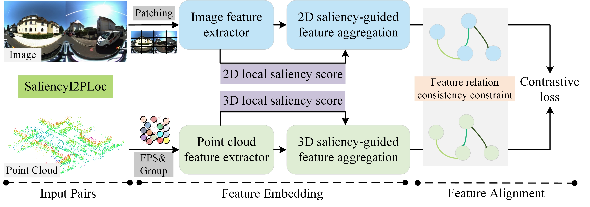

## SaliencyI2PLoc

Our SaliencyI2PLoc architecture is illustrated in 

__SaliencyI2PLoc__ encodes the input image-point cloud pairs into a high-dimensional feature embedding space using a feature encoder (ViT for images, mini-PointNet combined with Transformer for point clouds) and feature aggregator (saliency map boosted NetVLAD layer). It then achieves feature fusion and alignment through the contrastive learning loss function that incorporates cross-modal feature relationship consistency constraints.