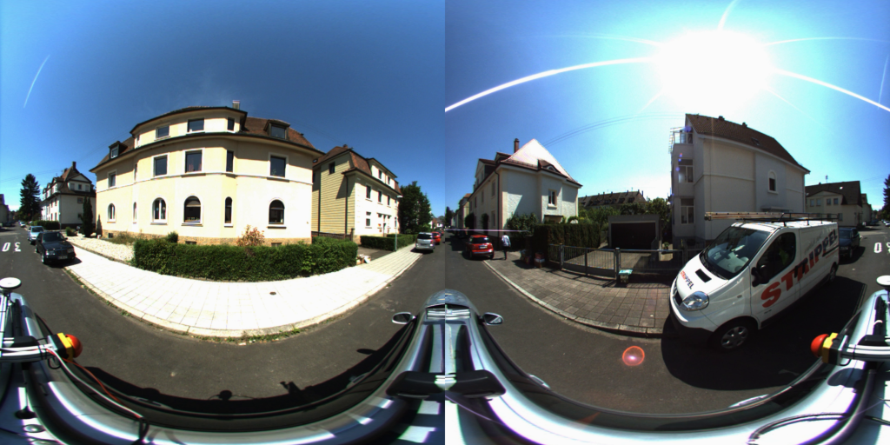
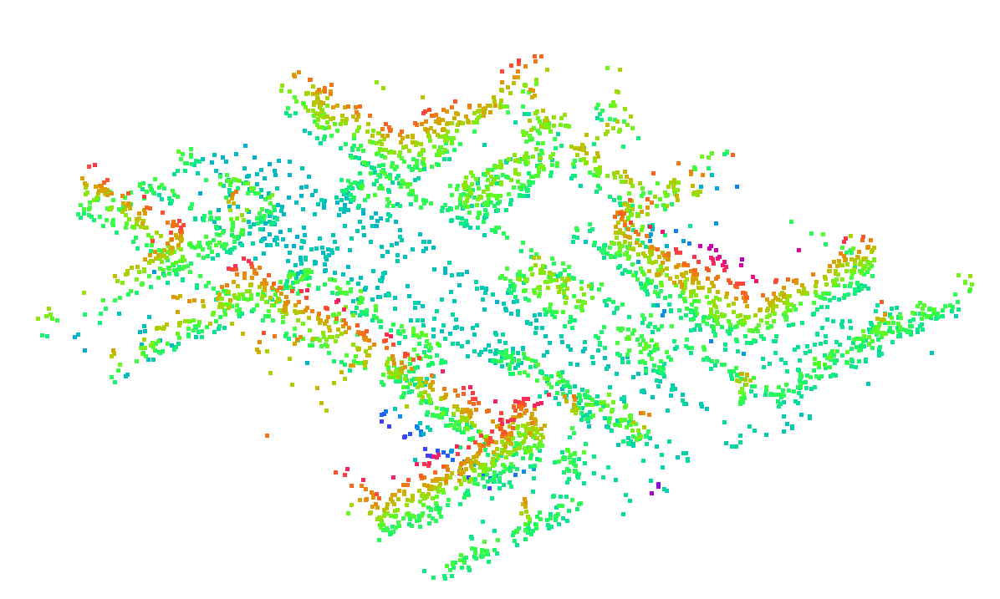

# KITTI360-dataset-generation

The following instructions tell us how preprocess the datasets, including KITTI360 global LiDAR point cloud map generation, sub-maps division, and panoramic image generation.

### KITTI360 dataset download

Downloads [KITTI360](https://www.cvlibs.net/datasets/kitti-360/) data raw sequences, including perspective and fisheye images and LiDAR point clouds frames.

### Submap generation

Call `kitti360_global_maps.py`, and see the parameters for detail informations. Basically, we process single sequence one time, and the ground and global maps will generates, no '.pcd' format file is generated.

```bash
python kitti360_global_maps.py --sequence 02 --kitti360Path /data --submapPath /data/data_3d_submap
```

#### Features

This code is originated from [kitti_maps.py](https://github.com/cattaneod/CMRNet/blob/master/preprocess/kitti_maps.py), but adds the following supports.

+ Global Map Making for KITTI360.

+ Submaps saved in `.bin` and `.pcd` in batch manner or single file format convertion.

+ Remove ground of LiDAR map. (May have more powerful methods to realize this operation.)

### Panorama images

We generate panorama images by sitching the fisheye images. 

More details at [blog](http://whu-lyh.github.io/blogs/2023/04/27/%E9%B1%BC%E7%9C%BC%E5%9B%BE%E5%83%8F%E8%BD%AC%E7%AD%89%E8%B7%9D%E6%8A%95%E5%BD%B1%E5%9B%BE%E5%83%8F/).

### Perspective images

To further evaluate the performance of the SaliencyI2PLoc, We build the dataset that consists of perspective images and LiDAR frame scan data. The format query and database is same as the panoramic images and submaps, while the perspective image(image_01) and scan data are used. The mismatches between the pose, image id, LiDAR id are solved during the dataset class `KITTI360Perspective`. No resize, downsample or ground removal operations are used for this dataset. More details could be found at `KITTI360Perspective.py`.

> The downsample operation is inherited from the Pointcloud place recognition task and we also conduct this to keep the comparsion fair.

|               Panoramic Images               |                 Point Cloud Submaps                 |
| :-------------------------------: | :--------------------------------------: |
|  |  |

## Uniform dataset structure

We follow the **MSLS** dataset structure to build our dataset. More details could be found at `KITTI360_MSLS.py` and [MSLS](https://github.com/whu-lyh/mapillary_sls).

## Train and evaluation dataset split

Following the setting of baseline ([AE-Spherical](https://github.com/Zhaozhpe/AE-CrossModal)), We selected 1501 pairs from urban scenario sequences (specifically from 00 sequence of KITTI360), and 1010 pairs from highway scenario sequences (the whole 03 sequence of KITTI360), for model evaluation. Additionally, we separated 3447 and 842 image-point cloud pairs from urban (from 18 sequence of KITTI360) and highway (from 07 sequence of KITTI360) scenarios respectively to evaluate the generalization.

## Final KITTI360 dataset file structure

+ For panoramic images

```bash
├── data_2d_pano_512_1024
|   ├── 2013_05_28_drive_0000_sync
│   │   ├── database.csv
│   │   ├── database_val.csv
│   │   ├── pano
│   │   │   └── data_rgb
│   │   ├── query.csv
│   │   ├── query_val.csv
│   ├── 2013_05_28_drive_0002_sync
│   │   ├── database.csv
│   │   ├── pano
│   │   │   └── data_rgb
│   │   └── query.csv
│   ├── 2013_05_28_drive_0003_sync
│   │   ├── database.csv
│   │   ├── database_val.csv
│   │   ├── pano
│   │   │   └── data_rgb
│   │   ├── query.csv
│   │   └── query_val.csv
...
```
+ For point cloud submaps

```bash
└── data_3d_submap_raw
    ├── 2013_05_28_drive_0000_sync
    │   └── submaps
    ├── 2013_05_28_drive_0002_sync
    │   └── submaps
    ├── 2013_05_28_drive_0003_sync
    │   └── submaps
...
```

## Acknowledgments

We thanks the [kitti360-map-python](https://github.com/Zhaozhpe/kitti360-map-python), [CMRNet](https://github.com/cattaneod/CMRNet/blob/master/preprocess/kitti_maps.py) for providing the basic point cloud processing codes.

